# Temporal-Matching in link-streams

## What is it about?
A link-stream is a sequence of pairs of the form (t,{u,v}), where t ∈ N represents a time instant and u ̸= v.

Given an integer γ and a link-stream L, the γ-link-stream of L is the set of temporally consecutive edges defined as {(t′, {u, v}) | t′ ∈  t, t + γ − 1 }, the sequence of all the γ-edges between vertices u and v, starting at time t.

The maximum temporal matching of a γ-link-stream is a maximum sized subset of its γ-edges, such that there is no pair of y-edges that "overlap".
Computing a maximum temporal matching is NP-hard, we introduce a way to compute a 2-approximation with a greedy algorithm, and to compute a quadratic kernel in polynomial time.

### An example of a link-stream

Here is a more fancy representation of these link-streams

### The 2-approximation algorithm
A greedy algorithm can compute a 2-approximation for the maximum temporal matching of a γ-link-stream.

Given a link-stream L with n edges and an integer γ, the γ-link-stream can be computed in O(n^2) in the worst case.
It is equivalent to sort the edges of L depending on t, then for each of them, look if there are (γ-1) consecutive edges after this one. Since the edges of L are sorted depending on t, there is a moment when you can stop looking forward for edges.

Then, given an γ-link-stream γL, the 2-approximation can be computed in O(n^2) in the worst case.
To do so, we build a subset of γL by taking e, its first γ-edge, adding it to the 2-approximation γ-edges list, and removing every γ-edges of γL that overlap with e. We loop while γL is not empty. The γ-edges of γL don't necessary have to be sorted, but the result depends on their order.

Overall, the worst case complexity of this 2-approximation algorithm is O(n^2): for the transformation of a link-stream L in a γ-link-stream, it is obtained when the earliest edge of L and the latest are separated by less than 

### Kernelisation algorithm
To compute the kernelisation algorithm for the maximum temporal matching of a γ-link-stream γL, we first have to compute A, a 2-approximation. We call K the number of the γ-edges in A, and S the result of the kernelisation.

First, we add A to S. Then, for every γ-edge e of A, we look for at most (2K-1) γ-edges in γL that overlap with e, and add them to S. Finally, S is a quadratic kernel for the maximal temporal matching of γL.

Of course, we would like this kernel to contain the less γ-edges possible.
We have two ways to do so:
-   since the kernel size depends on K, the 2-approximation size, we can compute different 2-approximations, and chose the smallest one.
-   once we have computed a 2-approximation A, we have to chose (2K-1) γ-edges in γL for each γ-edge in A. Since some γ-edges in A can "share" overlapping γ-edges in γL, we can chose cleverly these (2K-1) γ-edges such that the union of all these (2K-1) is the smallest.

**Antoine Roux** - *Rollernet-like-Tools* - [Rollernet-like-Tools](https://antoinedimitriroux.github.io/)

## Section 2

### Section 2-a

Du texte du texte du texte

### Section 2-b

Du texte du texte du texte

{
    "plugins": ["scripts"],
    "pluginsConfig": {
        "scripts": {
            "files": [
                "./index.js"
            ]
        }
    }
}

### Section 2-c

Du texte du texte du texte

## Section 3

### Section 3-a

Du texte du texte du texte

### Section 3-b

Du texte du texte du texte

### Section 3-c

Du texte du texte du texte

### Installing

